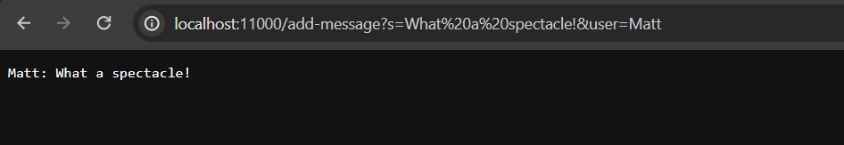
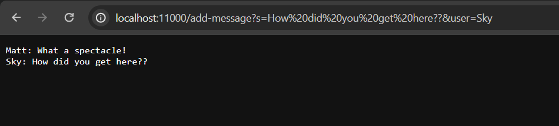
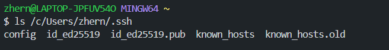
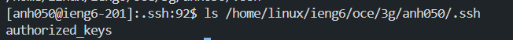
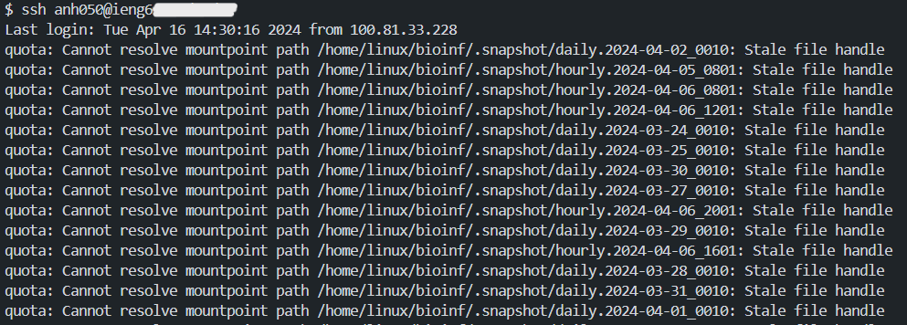

# Lab Report No. 2 &mdash; Web Servers & Secure Shell

> #### *"This laboratory report's itinerary: consult the bash terminal in inaugurating a linked connection to a chat web server implemented in Java; generate private and public authentication tokens via `ssh` (Secure Shell) to effortlessly connect to a remote server."*

## <ins>Part 1 &ndash; Implementation & Server Startup</ins>

------

### Chat Server Code
  
```java
import java.io.IOException;
import java.net.URI;

class Handler implements URLHandler {
    String chatLog = "";

    public String handleRequest(URI url) {
        if (url.getPath().equals("/")) {
            return chatLog;
        }
        else if (url.getPath().equals("/add-message")) {
                String[] args = url.getQuery().split("&");
                    String msg = args[0].substring(args[0].indexOf("=") + 1);
                    String user = args[1].substring(args[1].indexOf("=") + 1);
                    chatLog += String.format("%s: %s" + "\n", user, msg);
                    return chatLog;
                }
            
        return "404 Not Found!";
        }
    }

class ChatServer {
    public static void main(String[] args) throws IOException {
        if(args.length == 0){
            System.out.println("Missing port number! Try any number between 1024 to 49151");
            return;
        }

        int port = Integer.parseInt(args[0]);

        Server.start(port, new Handler());
    }
}
```

------

### Usage Cases

- ***INITIAL APPLICATION***


- **Q:**
  > *"Which methods in your code are called?"*
  - **A:** The `main()` method that is entombed within the `ChatServer` class, in tandem with the `handleRequest()` method in `Handler` are held liable for dictating the result showcased above.
    
- **Q:**
  > *"What are the relevant arguments to those methods, and the values of any relevant fields of the class?"*
  - **A:** The only pertinent argument that is passed to `main()` is the port identifier on which the remote connection will be instantiated. Line 43, `Server.start(port, new Handler());`, relies on this port argument in order to execute.

    `handleRequest()` is expecting an argument of type `URI`; analogously, a `URI` object is frankly a URL destination (depicted above). When `Server.start(port, new Handler());` is invoked later on, `handleRequest()` will process the URL allotted and can be applied.
    
    `handleRequest()` is reliant on one field: `chatLog` which is of type `String`. Its value is assigned no characters on initialization, but will begin to populate with characters provided `handleRequest` is invoked.

- **Q:**
  > *"How do the values of any relevant fields of the class change from this specific request? If no values got changed, explain why."*
  - **A:** The field `chatLog`, inside the `Handler` class, will periodically aggregate with formatted messages (see `chatLog += ...`) when the user provides `<user>` and `<s>` queries.
  
    Once these queries are imparted, `chatLog` will be re-assigned to the concatenation of the these two;
    with `<user>` prefacing `<s>` (the message).
     

- ***SECOND APPLICATION***


- **Q:**
  > *"Which methods in your code are called?"*
  - **A:** The `handleRequest()` method in `Handler` is the only method held liable for dictating the result showcased above.
    
- **Q:**
  > *"What are the relevant arguments to those methods, and the values of any relevant fields of the class?"*
  - **A:** `handleRequest()` is expecting an argument of type `URI`; analogously, a `URI` object is frankly a URL destination (depicted above). Given that the server has already commenced its initialization from the initial application, and the mandatory port has been connected to, any
    subsequent arguments that are handed to `handleRequest()` will result in the addendum of a new chat log stationed on a new line. 

    `handleRequest()` is reliant on one field: `chatLog` which is of type `String`. Its value is assigned no characters on initialization, but will begin to populate with characters provided `handleRequest` is invoked.

- **Q:**
  > *"How do the values of any relevant fields of the class change from this specific request? If no values got changed, explain why."*
  - **A:** The field `chatLog`, inside the `Handler` class, will periodically aggregate with formatted messages (see `chatLog += ...`) when the user provides `<user>` and `<s>` queries.

    Upon the second, third, *n*th invocation of `handleRequest()`, `chatLog` will be **appended** to with the latest result of concatenating `<user>` and `<s>` through the web URL. Hence, `chatLog` is updated based on subsequent user input to `<s>` and `<user>`.

------

## <ins>Part 2 &ndash; Secure Shell: Key Generation</ins>

- A **private** key stored **locally**
  - 

- A **public** key stored **remotely**
  - 

- The pleasantry of token authentication *(no password inquired)*
  - 

